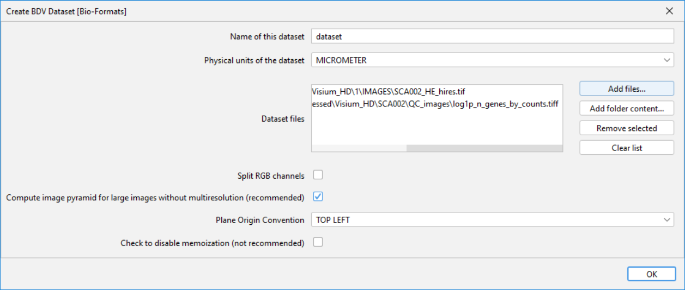
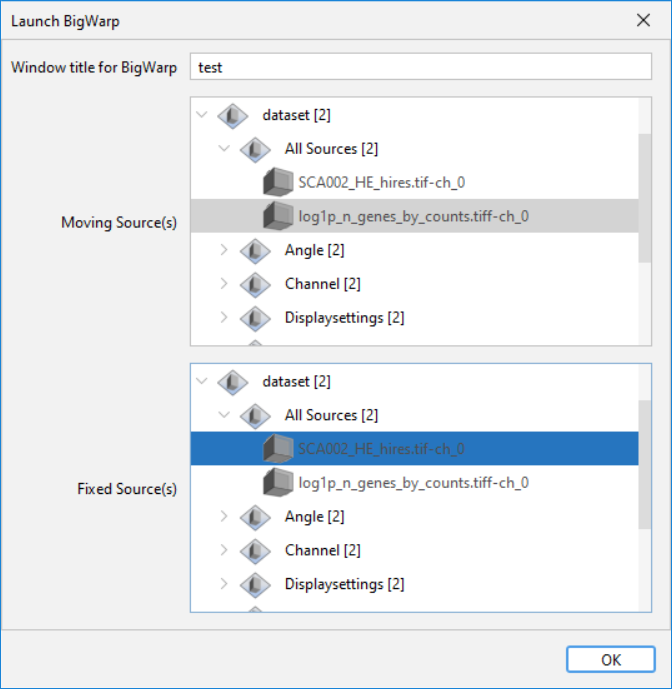
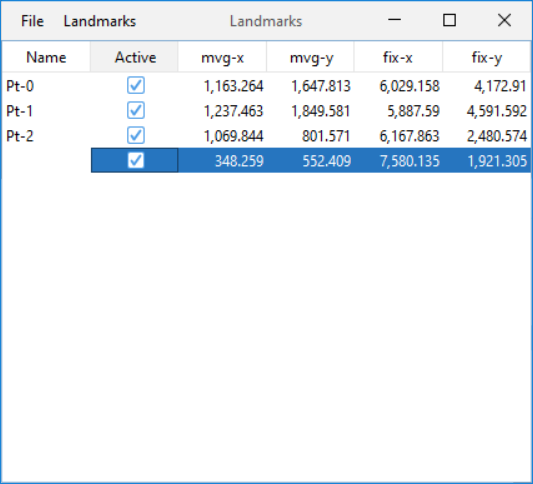
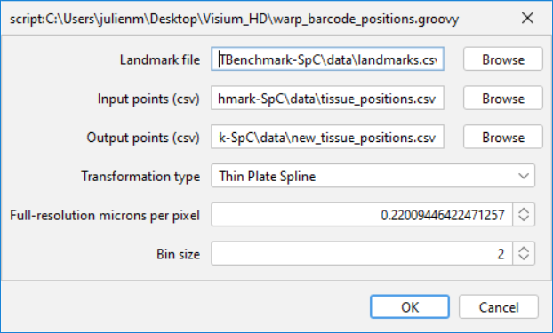

# Bigwarp correction of Visium HD registration

This document describes how to improve the registration of Visium HD barcode positions using Bigwarp.

## Prerequisites

We used the following version of Fiji/ImageJ:

- **ImageJ**: 1.54f
- **BigWarp**:
  - `bigdataviewer-playground-0.10.10.jar`
  - `bigdataviewer-biop-tools-0.10.9.jar`

You can download a zip archive with this exact combination of Fiji and BigWarp [here](https://objectstor.vib.be/s00-spatial.catalyst-team/sw/fiji-bigwarp/fiji-win64-bigwarp-9.1.3.zip). After downloading, unpack the zip file in any folder you like.

## Creating a Bigwarp dataset

To create a dataset for use in BigWarp, follow these steps:

1. Open the Fiji version specified in the prerequisites above.
2. Navigate to:  
   `Plugins > BigDataViewer-Playground > BDVDataset > Create BDV Dataset [Bio-Formats]`
3. In the dialog that appears, click `Add files...` and provide the paths to the **high-resolution H&E image** and the **transcript image**. The latter is an image where every pixel corresponds to a 2x2um spot with array_col and array_row as xy-coordinates (i.e. the coordinates of the spatial barcodes on the Visium HD capture slide) and the intensity of every pixel corresponds to either the total number of UMIs or total number of genes detected for this spot. Generally, we use the log1p-transformation of the total number of genes since this tends to show the tissue structure the best. The transcript image should ideally contain clear tissue structures or even nuclei that can be used to place landmarks in both the H&E and transcript image.

**Important**: Make sure to set the `Physical units of the dataset` to `MICROMETER` and the `Plane Origin Convention` to `TOP LEFT`!



## Launch Bigwarp

To launch BigWarp, navigate to:  
`Plugins > BigDataViewer-Playground > Sources > Register > Launch BigWarp`

In the dialog that appears, set the high-resolution H&E image as the `Fixed Source` and the transcript image as the `Moving Source`. The fixed image will serve as the reference coordinate space to which the moving image will be transformed.



## Placing landmarks

To register the moving image to the fixed image, you will need to place landmarks until you get good alignment. Note that this may take approximately 100 landmarks or more (depending on your tissue).  Below, we will explain some general guidelines and tips, but for a full list of navigation and editing commands, press `F1` or read the [BigWarp documentation](https://imagej.net/plugins/bigwarp).

- Press `P` to open the source card for editing source visualization modes, color, brightness, and contrast. If necessary, adjust the brightness and contrast appropriately. It is recommended to set the color of the transcript image to white. Note that you'll need to adjust these settings for both the `BigWarp moving image` and the `BigWarp fixed image` windows separately.
- Using left-click and drag, you can rotate one of the images until they are in the same orientation. You can use right-click and drag to pan (move) the image and the mouse wheel to zoom in and out until you find corresponding landmarks.
- Enter landmark mode by pressing the `space bar`. You can now left-click a cell (or another recognizable feature) in one of the images and subsequently left-click the corresponding cell/feature in the other image. A landmark will now have been added in the `Landmarks` window. It is also possible to delete landmarks by right-clicking them in the Landmarks window. When you want move around, make sure to disable landmark mode by pressing the space bar again. When placing landmarks, try to be as precise as possible to get good quality registration.
- You will need at least 4 landmarks before you can warp the moving image onto the fixed image and assess the registration quality. Click on the title bar of the fixed or moving image and press `F` to display a fusion of both images. Press `T` to warp the moving image onto the fixed image. You may need to place many more landmarks to obtain a nice registration, but after the first 4 landmarks, you can more easily find the corresponding regions by clicking the title bar of one of the images and pressing `Q` to display the region corresponding to the window of the other image.
- You can adjust the transformation type that is used for visualization of the fused image under Settings/Bigwarp options. Use `Thin Plate Spline` for a nonlinear transformation (e.g. when the tissue is slightly deformed or when small stitching errors occured) or use `Affine` for a linear transformation that only includes translation, rotation, scaling and shear. Note that in a Thin Plate Spline transformation, landmarks will be matched exactly. This will result in local registration issues around landmarks that are imprecisely placed. Affine transformations should be more robust against this since errors should be evened out more over the tissue.
- Save your landmarks regularly via `Bigwarp window > File > Export Landmarks`. If you need to stop and close Bigwarp, you can import these landmarks again at a later timepoint.
- Once you have obtained good registration over the entire tissue, you can save your landmarks and close Bigwarp.



## Transform barcode coordinates according to Bigwarp transformation
Drag and drop the `warp_barcode_positions.groovy` script into FIJI and click `Run`. Provide the paths to the landmark CSV, the Space Ranger tissue_positions file to be transformed (in CSV-format; see below) and the output CSV. Choose the Transformation type (e.g., Thin Plate Spline, Affine) and make sure to correctly specify the pixel size of the high-resolution H&E image (in micrometer) and the bin size of the barcode positions file to be transformed (in micrometer).



Since FIJI unfortunately does not support reading and writing Parquet files, you will need to convert the Space Ranger tissue_positions file to CSV first and potentially convert the CSV file containing the new barcode positions back to Parquet for some downstream applications.

#### Convert Parquet to CSV

```python
import pandas as pd
df = pd.read_parquet('tissue_positions.parquet')
df.to_csv('tissue_positions.csv', index=False)
```

#### Convert CSV to Parquet
```python
import pandas as pd
df = pd.read_csv('new_tissue_positions.csv')
df.to_parquet('new_tissue_positions.parquet', index=False)

```